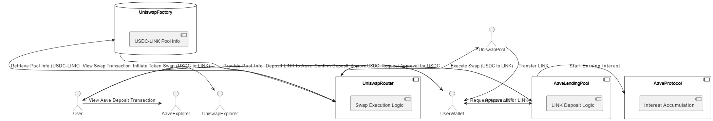

# DeFi Script: Uniswap and Aave Integration

## Overview of Script

This DeFi script builds upon a basic token swap on Uniswap and introduces additional functionalities by integrating Aave. The script performs the following operations:

1. **Token Swap on Uniswap**: 
    - The user initiates a token swap, exchanging USDC for LINK using Uniswap V3.
    - The script retrieves the necessary pool information from the Uniswap Factory contract, approves the swap router to spend USDC, and then executes the swap.
    - After the swap, the user receives LINK in their wallet.

2. **Supply LINK to Aave**:
    - The script automatically deposits the LINK acquired from the swap into Aave’s lending pool.
    - The user must approve the Aave lending pool to access their LINK.
    - Once deposited, the LINK begins accruing interest within Aave, adding an extra layer of functionality to the basic swap.

### Workflow

- **Step 1**: The user initiates the process by requesting a token swap from USDC to LINK on Uniswap.
- **Step 2**: The Uniswap Router requests approval from the user's wallet to spend USDC.
- **Step 3**: The script retrieves pool information (such as token pair addresses and fee tier) from the Uniswap Factory contract.
- **Step 4**: The Uniswap Router executes the swap, transferring the equivalent amount of LINK to the user's wallet.
- **Step 5**: The user then deposits the LINK into the Aave lending pool, which starts earning interest.

## Diagram Illustration

The diagram below illustrates the sequence of steps and interactions between the protocols, highlighting the flow of assets and operations between Uniswap and Aave:



### Components Involved:

- **User**: Initiates the swap and deposit operations.
- **Uniswap Router**: Manages the token swap on Uniswap.
- **Uniswap Factory**: Provides pool information required for the swap.
- **Uniswap Pool**: Executes the swap and transfers LINK to the user.
- **Aave Lending Pool**: Accepts the LINK deposit and manages it within Aave.
- **Aave Protocol**: Handles the accumulation of interest on the deposited LINK.

This diagram captures the complete process and the interaction between multiple DeFi protocols, showcasing the composability and integration potential in the DeFi space.


# Code Explanation

This document provides a comprehensive explanation of the code, detailing the key functions, logic, and how the interactions with Uniswap and Aave are managed.

## Overview

The script is designed to perform a token swap on Uniswap and then automatically deposit the swapped tokens into Aave for earning interest. Below is a breakdown of the major components and functions within the script:

### 1. Setting Up the Environment

The script begins by setting up the environment, including importing necessary libraries and initializing key variables. The `.env` file is used to store sensitive information such as the RPC URL and the user's private key.

### 2. `approveToken` Function

```javascript
async function approveToken(tokenAddress, tokenABI, amount, wallet) {
  const tokenContract = new ethers.Contract(tokenAddress, tokenABI, wallet);
  const approveAmount = ethers.parseUnits(amount.toString(), USDC.decimals);
  const approveTransaction = await tokenContract.approve.populateTransaction(
    SWAP_ROUTER_CONTRACT_ADDRESS,
    approveAmount
  );
  const transactionResponse = await wallet.sendTransaction(
    approveTransaction
  );
  const receipt = await transactionResponse.wait();
}


**Purpose**: This function approves the Uniswap Swap Router to spend a specified amount of USDC on behalf of the user. This is necessary before the swap can be executed.

**Key Operations**:
- Initializes the token contract using its address, ABI, and the user's wallet.
- Converts the amount to the appropriate units.
- Sends the approval transaction to the blockchain and waits for confirmation.

### 3. `getPoolInfo` Function

```javascript
async function getPoolInfo(factoryContract, tokenIn, tokenOut) {
  const poolAddress = await factoryContract.getPool(
    tokenIn.address,
    tokenOut.address,
    3000
  );
  const poolContract = new ethers.Contract(poolAddress, POOL_ABI, provider);
  const [token0, token1, fee] = await Promise.all([
    poolContract.token0(),
    poolContract.token1(),
    poolContract.fee(),
  ]);
  return { poolContract, token0, token1, fee };
}
```

**Purpose**: This function retrieves the liquidity pool information necessary for the swap.

**Key Operations**:
- Fetches the pool address for the USDC-LINK pair from the Uniswap Factory.
- Initializes the pool contract with the retrieved address and ABI.
- Retrieves the token addresses and fee tier associated with the pool.

### 4. `prepareSwapParams` Function

```javascript
async function prepareSwapParams(poolContract, signer, amountIn) {
  return {
    tokenIn: USDC.address,
    tokenOut: LINK.address,
    fee: await poolContract.fee(),
    recipient: signer.address,
    amountIn: amountIn,
    amountOutMinimum: 0,
    sqrtPriceLimitX96: 0,
  };
}
```

**Purpose**: This function prepares the necessary parameters required for executing the token swap on Uniswap.

**Key Operations**:
- Gathers the token addresses, fee tier, and recipient address.
- Sets the amount of USDC to be swapped and other relevant parameters.
- Returns an object containing all the parameters needed for the swap.

### 5. `executeSwap` Function

```javascript
async function executeSwap(swapRouter, params, signer) {
  const transaction = await swapRouter.exactInputSingle.populateTransaction(params);
  const receipt = await signer.sendTransaction(transaction);
}
```

**Purpose**: This function executes the token swap on Uniswap.

**Key Operations**:
- Populates the swap transaction using the parameters prepared earlier.
- Sends the transaction to the blockchain and waits for it to be mined.
- Logs the transaction receipt for tracking and verification.

### 6. `depositToAave` Function

```javascript
async function depositToAave(aaveLendingPool, tokenAddress, amount, wallet) {
  const approveTx = await approveToken(tokenAddress, TOKEN_ABI, amount, wallet);
  const depositTx = await aaveLendingPool.deposit(tokenAddress, amount, wallet.address, 0);
  await depositTx.wait();
}
```

**Purpose**: This function deposits the swapped LINK tokens into Aave to start earning interest.

**Key Operations**:
- Approves Aave to spend the LINK tokens.
- Sends the deposit transaction to Aave's lending pool contract.
- Waits for the deposit transaction to be confirmed on the blockchain.

### 7. `main` Function

```javascript
async function main(swapAmount) {
  const amountIn = ethers.parseUnits(swapAmount.toString(), USDC.decimals);

  try {
    await approveToken(USDC.address, TOKEN_IN_ABI, swapAmount, signer);
    const { poolContract } = await getPoolInfo(factoryContract, USDC, LINK);
    const params = await prepareSwapParams(poolContract, signer, amountIn);
    const swapRouter = new ethers.Contract(SWAP_ROUTER_CONTRACT_ADDRESS, SWAP_ROUTER_ABI, signer);
    await executeSwap(swapRouter, params, signer);
    await depositToAave(aaveLendingPool, LINK.address, amountIn, signer);
  } catch (error) {
    console.error("An error occurred:", error.message);
  }
}
```

**Purpose**: The main function orchestrates the entire process, from approving the tokens to executing the swap and finally depositing the swapped tokens into Aave.

**Key Operations**:
- Converts the swap amount to the correct units.
- Calls the `approveToken`, `getPoolInfo`, `prepareSwapParams`, `executeSwap`, and `depositToAave` functions in sequence to complete the entire workflow.

## Summary

This code is designed to showcase the composability and integration potential within the DeFi ecosystem. By performing a token swap on Uniswap and then utilizing the swapped tokens within Aave, the script demonstrates how different protocols can be combined to create more complex and valuable financial operations.
```

